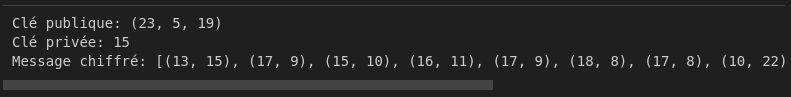

# Algorithm EEA
## EEA : EPS Encryption Algorithm
L'algorithme de chiffrement LTE s'appelle EEA (EPS Encryption Algorithm). EPS signifie Evolved Packet System, qui est l'architecture du réseau central de LTE. EEA est basé sur un chiffrement par flot, qui génère un flux de clés de bits aléatoires qui sont combinés avec les données en utilisant une opération bit à bit.

## Commençons le chiffrement
```python
import random
```
### Fonction pour calculer le module inverse d'un nombre a dans le champ m

```python
def mod_inverse(a, m):
    for x in range(1, m):
        if (a * x) % m == 1:
            return x
    return None

```
### Fonction pour générer une clé publique et privée

```python
def generate_keypair(p, g):
# Sélectionnez un nombre aléatoire privé x dans la plage [1, p-2]
x = random.randint(1, p-2)
# Calculer la valeur de y = g^x mod p
y = pow(g, x, p)
# Renvoie la clé publique (p, g, y) et la clé privée x
return (p, g, y), x
```
### Fonction pour chiffrer un message à l'aide d'une clé publique

```python
def encrypt(message, public_key):
    p, g, y = public_key
 # Convertir chaque caractère du message en sa valeur ASCII
    # et chiffrez-le à l'aide de la clé publique
    ciphertext = []
    for char in message:
        k = random.randint(1, p-2)
        a = pow(g, k, p)
        b = (pow(y, k, p) * ord(char)) % p
        ciphertext.append((a, b))
    return ciphertext
```

### Fonction pour déchiffrer un message chiffré à l'aide d'une clé privée

```python
def decrypt(ciphertext, private_key):
    p, _, _ = private_key
       # Déchiffrer chaque paire (a,b) du message chiffré à l'aide de la clé privée
    plaintext = ''
    for a, b in ciphertext:
        a_inv = mod_inverse(pow(a, private_key, p), p)
        char = (a_inv * b) % p
        plaintext += chr(char)
    return plaintext
```

### Exemple d'utilisation

```python
if __name__ == '__main__':
   # paramètres d'algorithme
    p = 23
    g = 5
  
   # Générer une clé publique et privée
    public_key, private_key = generate_keypair(p, g)
    print("Clé publique:", public_key)
    print("Clé privée:", private_key)

     # Message à chiffrer
    message = "Bonjour beidi!"

   # Crypter le message à l'aide de la clé publique
    ciphertext = encrypt(message, public_key)
    print("Message chiffré:", ciphertext)

     # Déchiffrer le message chiffré à l'aide de la clé privée
    plaintext = decrypt(ciphertext, private_key)
    print("Message déchiffré :", plaintext)
```
***Ce code génère une clé publique et privée en utilisant les paramètres p et g. Ensuite, il crypte un message à l'aide de la clé publique et le décrypte à l'aide de la clé privée.***

